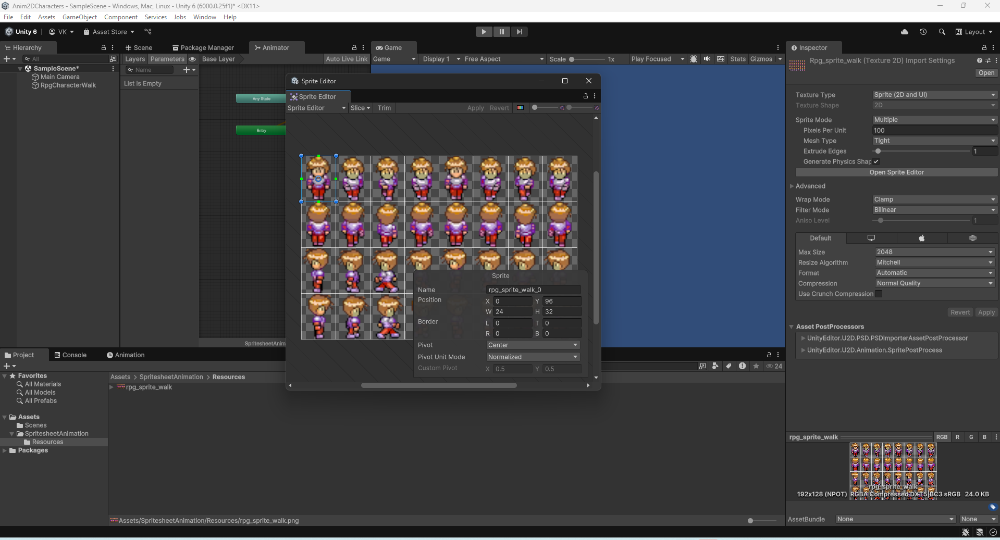
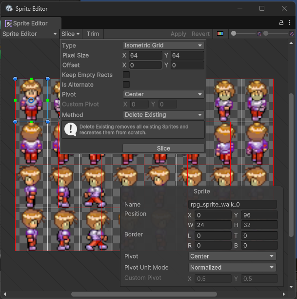
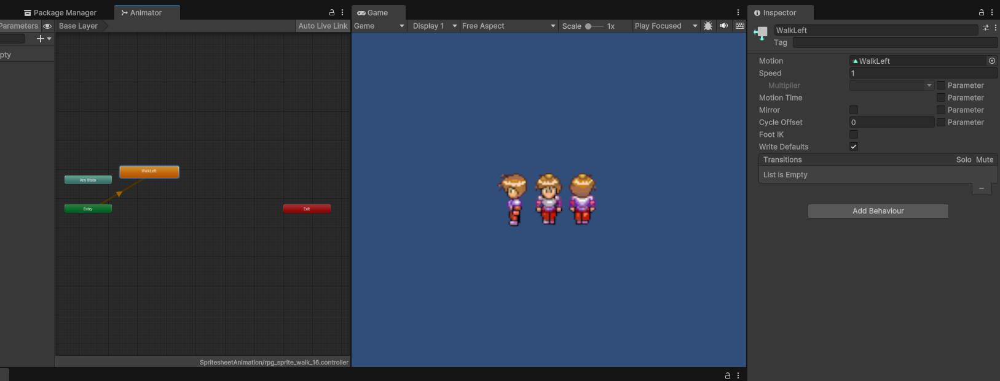
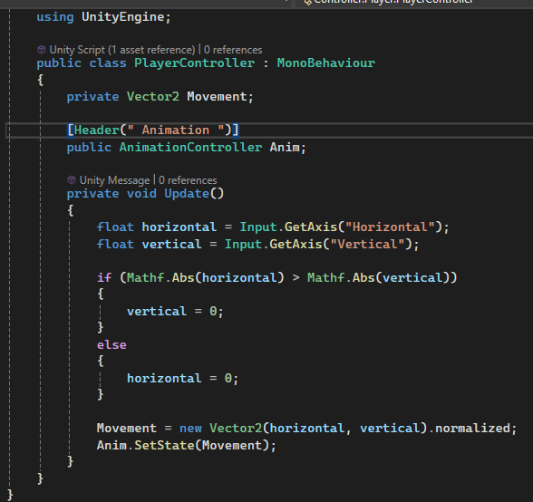
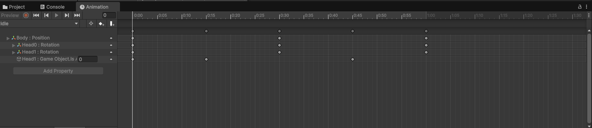
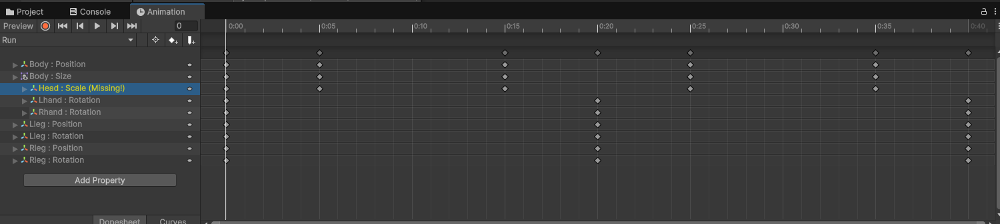
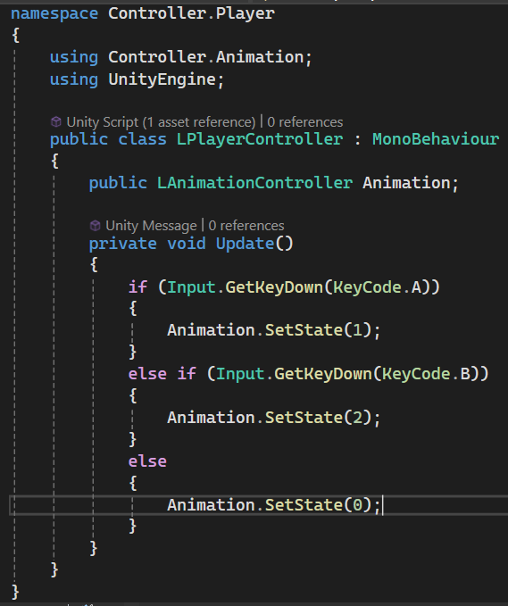
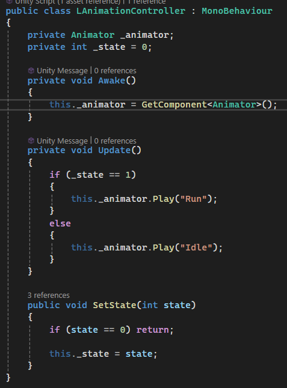
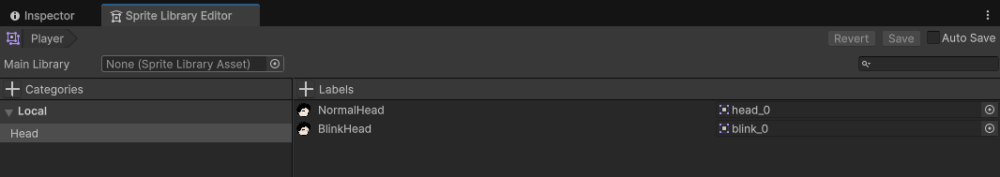
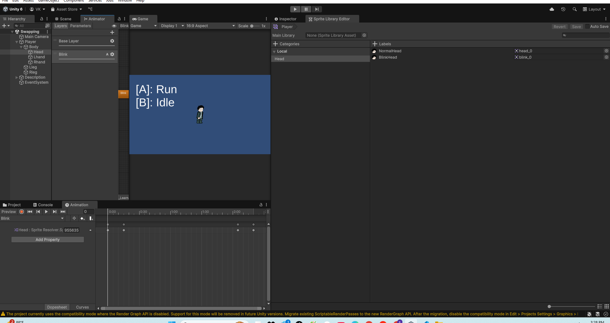

# Animation
## Sprite Sheet
### Add Spritesheet
> ##### Texture Type: Sprite (2D and UI).
> ##### Sprite Mode: Multiple.
> ##### Open Sprite Editor &rarr; Slice &rarr; Isometric Grid. 
> 
> 
### Inspector Animator
> ##### Window &rarr; Animation &rarr; Animator. 
> ##### Click: Component want check infor.
> 
### Create AnimationController For Player
> ##### Create Player:
> ###### Sprite Renderer &rarr; Sprite: sprite0.
> ###### Animator &rarr; Controller: walk (walk_up, walk_down, walk_right, walk_left).
> ##### Code PlayerController:
>  
> ##### Code AnimationController:
> 
## Layered Sprite
### Pivot
> ##### In Unity, the "pivot" is the reference point or rotation point of an object or sprite in 2D/3D space.
### Create AnimationController For Player
> ##### To create a correct animation, the states must be symmetrical.
> ##### Idle
> 
> ##### Run
> 
> ##### PlayerController
> 
> ##### AnimationController
> 
## Rigged Animation
### Skinning Editor
> ##### Create Bone.
> ##### Auto Weights &rarr; Associate Bones &rarr; Generate.
> ##### Back Preview Pose
> 
## Sprite Swapping
### Sprite Libraries
> ##### Open Sprite Edit &rarr; Catagories rarr; Lables.
> ##### Add Sprite.
> 
> ##### HeadAnimator &rarr; Blink: Blending Additive & Weights = 1.
### Add animation by unity
> ##### 
